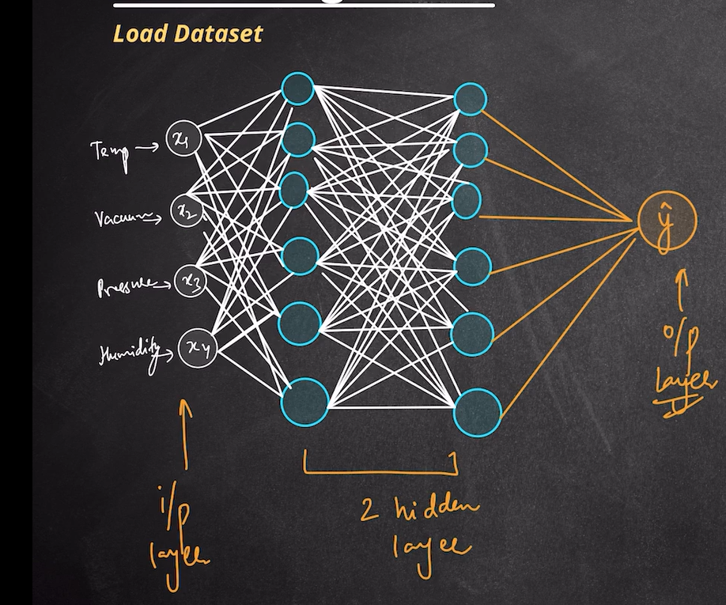

# 🧠 ANN Regression using PyTorch

A deep learning regression model built with **PyTorch** to predict **Electrical Power Output (PE)** from environmental conditions using an Artificial Neural Network (ANN).

This project demonstrates the complete deep learning pipeline, from data preprocessing to model evaluation.

---

## 🚀 Features

- Data preprocessing
- Train/Test split
- Feature Scaling
- Custom ANN built using PyTorch
- Mini-batch training with DataLoader
- Regression using Mean Squared Error Loss
- Model evaluation
- Prediction on unseen data

---

## 🏗️ Model Architecture

<p align="center">
  
</p>

### Network Architecture

```
Input Layer (4 Features)
        │
        ▼
Hidden Layer 1 (ReLU)
        │
        ▼
Hidden Layer 2 (ReLU)
        │
        ▼
Output Layer (1 Neuron)
```

### Input Features

| Feature | Description |
|---------|-------------|
| AT | Ambient Temperature |
| V | Exhaust Vacuum |
| AP | Ambient Pressure |
| RH | Relative Humidity |

### Output

Predicted **Electrical Power Output (PE)**

---

## 📂 Dataset

The model is trained on the **Combined Cycle Power Plant Dataset**.

### Input Variables

- Ambient Temperature (AT)
- Exhaust Vacuum (V)
- Ambient Pressure (AP)
- Relative Humidity (RH)

### Target Variable

- Electrical Energy Output (PE)

---

## 📁 Project Structure

```
ANN_Regression/
│
├── ANN_for_Regression.ipynb
├── architecture.png
├── README.md
└── dataset/
    └── power_plant.csv
```

---

## ⚙️ Technologies Used

- Python
- PyTorch
- Pandas
- NumPy
- Scikit-Learn
- Matplotlib

---

## 🔄 Workflow

```
Dataset
   │
   ▼
Preprocessing
   │
   ▼
Train/Test Split
   │
   ▼
Feature Scaling
   │
   ▼
PyTorch Dataset
   │
   ▼
ANN Model
   │
   ▼
Training
   │
   ▼
Validation
   │
   ▼
Prediction
```

---

## 🧠 ANN Overview

- **Input Layer:** 4 neurons
- **Hidden Layers:** 2 Fully Connected Layers
- **Activation Function:** ReLU
- **Output Layer:** 1 neuron (Regression)
- **Loss Function:** Mean Squared Error (MSE)
- **Optimizer:** Adam

---

## 📊 Model Pipeline

1. Load Dataset
2. Clean & preprocess data
3. Standardize features
4. Convert data to tensors
5. Create DataLoaders
6. Train ANN
7. Evaluate model
8. Make predictions

---

## 📦 Installation

Clone the repository

```bash
git clone https://github.com/Saikiran-Sugurthi/Machine_Learning.git
```

Move into the project folder

```bash
cd Machine_Learning/ANN_Regression
```

Install dependencies

```bash
pip install -r requirements.txt
```

Launch Jupyter Notebook

```bash
jupyter notebook ANN_for_Regression.ipynb
```

---

## 📚 Learning Outcomes

This project covers:

- Artificial Neural Networks
- Regression using Deep Learning
- PyTorch Fundamentals
- DataLoader & TensorDataset
- Model Training
- Backpropagation
- Optimization using Adam
- Model Evaluation

---

## 👨‍💻 Author

**Sai Kiran Sugurthi**

GitHub: https://github.com/Saikiran-Sugurthi

If you found this project useful, consider giving it a ⭐.